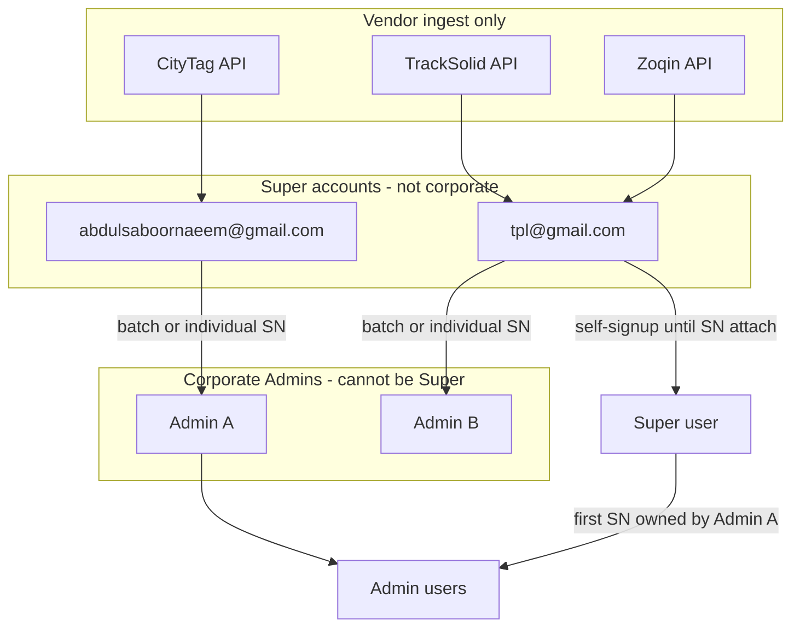

# Confirmed Super → Admin → User Flow

Yes — the complete flow is understood. This plan records it as the source of truth for ownership (it extends, not replaces, the existing [three-tier RBAC plan](.cursor/plans/three-tier_rbac_migration_2dea889e.plan.md)).

## Confirmed hierarchy

**Roles**

- **Super:** only `tpl@gmail.com` and `abdulsaboornaeem@gmail.com`. Corporate accounts stay `admin` and cannot be promoted to Super for now.
- **Admin:** corporate accounts created/managed by Super. They only see devices Super assigned to them, and users with `admin_id` = their id.
- **User:** either Super-parented (self-signup, no Admin SN yet) or Admin-parented (created by Admin, or self-signup after first Admin SN).

## 1. Vendor ingest (unchanged destination, must actually stamp owner)

All vendor-API devices land on Super accounts first — never directly on a corporate Admin.

| Vendor | Registry / device owner |
|--------|-------------------------|
| CityTag | `abdulsaboornaeem@gmail.com` |
| TrackSolid | `tpl@gmail.com` |
| Zoqin | `tpl@gmail.com` |

Today [`vendor_sync.py`](backend/app/services/vendor_sync.py) writes new SNs into [`devices.json`](backend/app/data/devices.json) with those emails, but **does not re-apply** registry `admin` onto `devices.admin_id` after Super reassigns. Implementation must use a single `resolve_device_ownership()` on every sync cycle (already specified in the RBAC plan).

**Default for two Super logins:** both are platform `super_admin` (full fleet + assign UI). Vendor emails are **ingest buckets**, not separate tenants. Super A can assign a CityTag SN; Super B can assign a TrackSolid SN. If you later want each Super to see only their vendor bucket, that is a follow-up.

## 2. Super assigns devices to Admin

- Super assigns **batches** and **individual SNs** to an Admin.
- Super can later **reassign or unassign** (Admin → another Admin, or back to Super ingest owner).
- **If the SN is currently assigned to a User, reassignment is blocked** until Super/Admin unbinds that User first. Then Super may move the free device.
- After assignment: `device.admin_id` = Admin `_id`, `super_admin_owned` = false. Admin may then assign that SN to **their** users only.

## 3. Self-signup (public `/register`)

Today [`POST /register`](backend/app/routers/auth.py) creates a user with **no** `admin_id`. Target:

1. New signup user is a **Super user**: `admin_id` = `tpl@gmail.com` Super account `_id` (your choice: always tpl until an Admin SN attaches them). Role stays `user`.
2. They add a device by SN:
   - **SN already assigned to an Admin** → set that user’s `admin_id` to that Admin. They now belong to that corporate account.
   - **SN still Super-owned** (not given to any Admin) → user stays under tpl; device stays Super-owned; `devices.user_id` = this user.
3. **After the first Admin match, they may only add SNs that belong to that same Admin.** Other Admin SNs and leftover Super SNs are rejected with a clear 403.
4. If the SN is already bound to another user → keep existing 409.

Admin-created users skip this: they are created with `admin_id` set immediately and never sit in the Super user pool.

## 4. What is already decided vs leftover defaults

**Decided in this conversation**

- Ingest: CityTag → Abdul Super; TrackSolid/Zoqin → tpl Super.
- Super assigns batches + individual SNs; reassign/unassign allowed.
- Reassign blocked while a User still has that SN.
- Self-signup parents to **tpl** until first Admin SN.
- After first Admin SN, user is locked to that Admin’s devices only.

**Defaults (say if you disagree)**

- Both Super emails are full platform Super Admins (not vendor-siloed UIs).
- Unassign = device returns to the original ingest Super (`super_admin_owned: true`, `admin_id: null`), not to a generic pool.
- Super can still **manually** move a Super user onto an Admin without an SN (Users tree), in addition to SN auto-attach.
- Users created by Admin cannot later “jump” to another Admin via SN; only self-signup users auto-attach once.

**Not a gap:** historical GPS sync stays keyed by SN in `latestLocation`; RBAC scopes via `devices` at query time.

## Implementation note

When you approve implementation, follow the existing RBAC plan phases, with these ownership rules wired into [`device_ownership.py`](backend/app/services/device_ownership.py) (vendor sync + bind + Super batch) and signup/bind in [`auth.py`](backend/app/routers/auth.py) / [`device_binding.py`](backend/app/services/device_binding.py).
