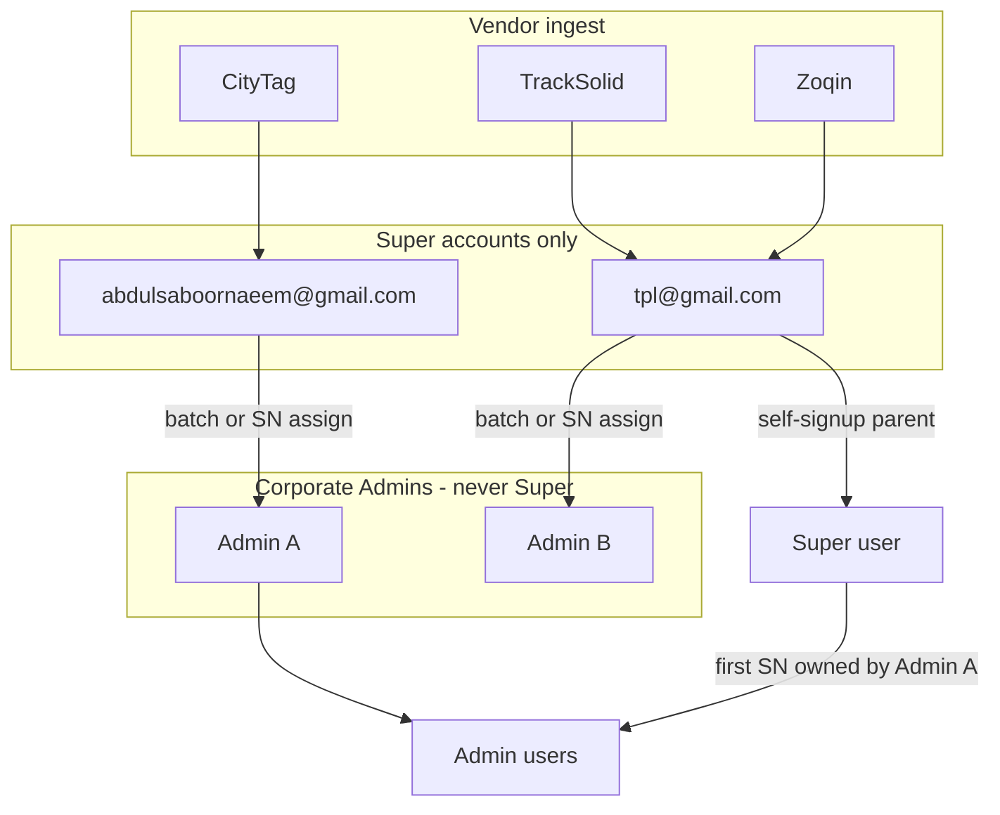
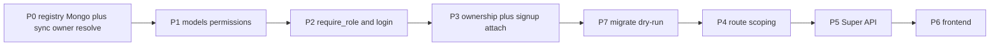

# Merged Three-Tier RBAC + Device Ownership Plan

This document **replaces** [three-tier_rbac_migration_2dea889e.plan.md](.cursor/plans/three-tier_rbac_migration_2dea889e.plan.md) and [confirmed_device_ownership_flow_5caf5ffe.plan.md](.cursor/plans/confirmed_device_ownership_flow_5caf5ffe.plan.md). Conflicts are resolved below. Implementation must not start until this plan is approved.

**Codebase audit:** backend routers/services/models and frontend `App.jsx`, auth, caches, bind UIs, and permission gates were checked against both original plans. Findings are in **Dependency risks** and the appendix.

---

## 1. Product flow (confirmed)



| Role | Who | Devices they see | Users they see |
|------|-----|------------------|----------------|
| `super_admin` | Only `tpl@gmail.com` and `abdulsaboornaeem@gmail.com` (promoted, same `_id`) | Entire fleet | All users, grouped by Admin + Super-parented |
| `admin` | Corporate accounts (`walishajeeh66@gmail.com`, `tpl123@gmail.com`, future) | Only SNs Super assigned to them | Only `user.admin_id == self` |
| `user` | Admin-created, or self-signup | Only `device.user_id == self` | Self |

**Ingest buckets (registry `owner_email` on new SNs):**

- CityTag → `abdulsaboornaeem@gmail.com`
- TrackSolid / Zoqin → `tpl@gmail.com`

**Both Super logins are full platform Super Admins** (not vendor-siloed UIs). Ingest emails only decide default registry owner and where unassign returns a device.

**Super assign:** batches and individual SNs to an Admin; later reassign/unassign allowed. **Blocked while `devices.user_id` is set** — unbind the user first.

**Unassign:** device returns to Super-owned (`super_admin_owned: true`, `devices.admin_id: null`); registry `owner_email` restored to the **original ingest Super** for that vendor.

**Self-signup (`POST /register`):**

1. Create `role: user` with `admin_id` = **tpl Super `_id`**.
2. Add device by SN (must already exist from vendor sync — **no ghost SN create**).
3. If that SN’s owner is a **corporate Admin** → set `user.admin_id` to that Admin (one-time attach).
4. If SN is still Super-owned → user stays under tpl; bind `user_id`; device stays Super-owned.
5. After attach to Admin A, **only Admin A’s SNs** may be added (other Admin SNs and Super-owned SNs → 403).
6. SN already bound to another user → existing 409.
7. Admin-created users start with corporate `admin_id` and **cannot jump** via SN.

**Manual move:** Super may also move a Super-parented user onto an Admin from the Users tree (no SN required).

**Delete Admin:** refuse if the Admin still has users or assigned devices; otherwise hard-delete the Admin account.

---

## 2. Conflicts resolved (old RBAC vs confirmed flow)

| Topic | Old RBAC plan | Confirmed flow | **Winner** |
|-------|---------------|----------------|------------|
| Super-owned devices | `admin_id: null` + `super_admin_owned: true` | Ingest to Super emails | **Both:** registry keeps ingest email; `devices.admin_id` is **null** while Super-owned so both Super UIs see the fleet |
| Signup user parent | Implied retail / null `admin_id` | `admin_id` = tpl Super | **Confirmed:** tpl Super `_id` |
| Unknown SN on user bind | Create retail registry row | Devices come from vendor APIs | **Confirmed:** 404 if SN not in `devices` / registry |
| Vendor sync vs registry owner | Fix to re-apply every cycle | Same | Keep |
| Super reassignment | Implied | Allow; **block if user-bound** | **Confirmed** |
| After first Admin SN | User 1:1 Admin | Lock to that Admin’s SNs only | **Confirmed** |
| Bind tree “owner mismatch” | 403 | Attach Super-user **to** that Admin on first Admin SN | **Special-case Super-parented users only**; Admin-created users still 403 on foreign SN |
| Two Super UIs | Unspecified | Full platform Super | **Confirmed** |
| `require_role("admin")` | Super is a superset | Corporates cannot be Super | Super may call admin routes; corporates stay `admin` |

---

## 3. Current code vs target (audit)

Today is a **single-company** model: any admin sees all users/devices. Evidence: [`admin_users.py`](backend/app/routers/admin_users.py) lists all `role: user`; [`device_binding.py`](backend/app/services/device_binding.py) does not enforce cross-admin ownership; [`get_authorized_device_sns`](backend/app/services/mongodb.py) returns all SNs for `AdminInDB`.

Vendor sync already defaults CityTag vs TPL emails in [`device_registry.py`](backend/app/services/device_registry.py) / [`vendor_sync.py`](backend/app/services/vendor_sync.py), but **`upsert_device_from_citytag` only sets `admin_id` if missing** (line 603) and always passes the **sync account** `_id`, ignoring registry `admin` after Super reassigns.

Frontend `isAdmin` is **`role === "admin"` only** ([`AuthContext.jsx`](frontend/src/context/AuthContext.jsx)). Promoting Super without treating `super_admin` as elevated would show **user UI** to Super.

Permissions today: three booleans on accounts, mirrored in login payload, Sidebar, App route guards, UsersPage toggles, Fencepage.

---

## 4. Dependency risks (must fix in the same change set as role promotion)

**Promoting tpl/abdul to `role: "super_admin"` will break ingest and login unless every `role: "admin"` lookup is widened.**

These currently query **exact** `role: "admin"`:

- [`vendor_sync.py`](backend/app/services/vendor_sync.py) CityTag + TrackSolid + Zoqin account lookup
- [`historical_sync.py`](backend/app/services/historical_sync.py) tpl lookup
- [`mongodb.py`](backend/app/services/mongodb.py) `get_admin_by_email`, `get_admin_by_id`, `update_admin_token`, `create_or_update_admin`
- [`auth.py`](backend/app/routers/auth.py) admin-first login via `get_admin_by_email`
- [`seed_users.py`](backend/seed_users.py), [`seed_zoqin_locations.py`](backend/seed_zoqin_locations.py)

**`require_role` allowlist** is only `admin` / `user` / `any` ([`dependencies.py`](backend/app/dependencies.py) line 204). Super would 500/403. `require_role("admin")` must accept `admin` **or** `super_admin` and return an object that passes `isinstance(..., AdminInDB)` (used in binding, categories, geofence, field_staff).

**`create_device` requires `admin_id` ObjectId.** Super-owned upserts cannot keep passing Super `_id` if the device rule is `admin_id: null`. Change create/upsert to allow null + `super_admin_owned: true`.

**Device list for Super:** [`_build_admin_device_query`](backend/app/routers/devices.py) is `{admin_id: admin_oid}`. Super-owned docs with `admin_id: null` would **disappear**. Super query = unfiltered (or `super_admin_owned` + all `admin_id`s). Corporate Admin stays `{admin_id: self}`.

**Signup attach vs existing bind:** [`bind_device_service`](backend/app/services/device_binding.py) only auto-links if `not current_account.admin_id`. After signup sets tpl Super as `admin_id`, that branch **never runs**. Ownership service must: if user’s `admin_id` is a Super account and the SN’s owner is a corporate Admin, **move** `user.admin_id` once.

**Name uniqueness** `is_device_name_taken(admin_id)` — Super-owned devices with null `admin_id` need a Super-owned uniqueness scope (or skip uniqueness when no admin_id).

**Caches:** [`Usercachecontext.jsx`](frontend/src/context/Usercachecontext.jsx) fetches only if `isAdmin`. Super must fetch. [`DeviceCacheContext`](frontend/src/context/DeviceCacheContext.jsx) / [`fleetCache.js`](frontend/src/utils/fleetCache.js) must keep using scoped `getDevices` after backend filter (no extra client filter required if API is correct). Logout already `clearAppCaches()`.

**Open endpoints:** `POST /api/sync/all` unauthenticated; `GET /api/devices/validate/{sn}` public. Super-only on sync; validate requires auth or non-leaking `{exists}` without extra metadata.

**`field-staff` route** in [`App.jsx`](frontend/src/App.jsx) is not admin-gated (nav is). Gate Super + Admin.

**JWT / login payload:** `_admin_account_payload` hardcodes `"role": "admin"`. Super login must return `role: super_admin` + `permissions` or the SPA will treat Super as a normal admin (Users page without Super tree / assign UI).

**Pydantic / `AdminInDB`:** extra account fields (`permissions`, `company`) are ignored today; add them to `AccountInDB` / login payload so the SPA can store them.

**Dual-write `devices.json`:** vendor sync and historical sync still call `load_devices` / `append_device`. Mongo registry must keep that API. Do not break the 5 min / 15 min loops in [`auto_sync.py`](backend/app/services/auto_sync.py).

**Do not put `admin_id` on `locations` / `latestLocation`.** History stays SN-keyed; scope via `devices` join.

**Seed leftover admins:** `walishajeeh66@gmail.com` and `tpl123@gmail.com` stay `admin` with `super_admin_id` → tpl.

---

## 5. Implementation order (dependencies)

Vendor integrity **before** UI. Migration **before** turning on scoped queries in production (or scoping would hide most of the fleet).



Phase 0 can land first if lookups accept `role in (admin, super_admin)` **before** or **in the same deploy as** promotion.

---

## 6. Backend work (phases)

### Phase 0 — Registry + vendor sync

- Mongo `device_registry` with unique `sn`; dual-write JSON during transition.
- `resolve_device_ownership()` on every vendor upsert; **re-apply** `admin_id` / `super_admin_owned` each cycle (fix line 603).
- New SN: CityTag → Abdul email; TrackSolid/Zoqin → tpl email; `owner_type: super_admin`, `owner_admin_id: null`.
- Historical sync: only widen account lookup; no schema change on pings.

### Phase 1 — Models

- `permissions` object; `AccountInDB.role` includes `super_admin`.
- `DeviceInDB.super_admin_owned`.
- Zones: `created_by`, `created_by_role`.
- Dual-read legacy booleans until migration finishes.

### Phase 2 — Auth middleware

- `require_role("super_admin")`; `require_role("admin")` includes Super; `require_permission`.
- `get_admin_by_email/id` and token update: `role in ["admin", "super_admin"]`.
- Login/register payloads: `role`, `permissions`, `admin_id`, `company`.
- Register: set `admin_id` to tpl Super `_id`.

### Phase 3 — Ownership + bind

Single service used by vendor sync, user/admin bind, Super assign:

- Super assign/unassign/reassign; 409 if `user_id` set.
- User bind: Super-parented + Admin-owned SN → attach user to that Admin.
- Same-Admin lock after attach.
- Admin bind only own devices and own users.
- Unknown SN → 404.

### Phase 4 — Scoping

[`scope.py`](backend/app/services/scope.py): `devices_query_for`, `users_query_for`, `assert_device_access`.

Touch: `admin_users`, `admin_devices`, `devices` (including validate/check), `history`, `location` (admins currently skip ownership), `zones`, `geofence`, `field_staff`, `categories`, `sync`. Fix `get_authorized_device_sns`.

### Phase 5 — Super API

[`backend/app/routers/super_admin.py`](backend/app/routers/super_admin.py) `/api/super-admin`:

- Admin CRUD (delete blocked if users/devices remain)
- Device registry list + batch/individual assign + unassign
- Users under an Admin; permission override
- Overview stats

Register in [`main.py`](backend/app/main.py).

### Phase 7 — Migration script

[`backend/scripts/migrate_hierarchy.py`](backend/scripts/migrate_hierarchy.py) `--dry-run`:

1. Promote tpl + Abdul to `super_admin`
2. Other admins: `super_admin_id` → tpl, full admin permissions, `company` if missing
3. Users: permissions from booleans; **do not** mass-assign `admin_id` to tpl (existing users may already have null or an admin — preserve; only new signups use tpl parent)
4. Import `devices.json` → `device_registry`
5. Reconcile `devices.admin_id`: Super emails → `null` + `super_admin_owned: true`; other emails → that Admin `_id`
6. Zones `created_by*`
7. Print counts / mismatches

Staging dry-run on `citytag_development` snapshot. Do not auto-run in prod.

Indexes: `accounts {role, admin_id}`, `{role, super_admin_id}`; `device_registry` unique `sn`; `devices {admin_id, super_admin_owned}`.

---

## 7. Frontend work

Treat Super as elevated **everywhere `isAdmin` is used** (not only Sidebar). Split:

- `isSuperAdmin = role === "super_admin"`
- `isStaff = isSuperAdmin || role === "admin"` (replaces most current `isAdmin` gates)
- `hasPermission(flag)` for users; Super skips checks

**Must update (original plans missed several):**

- Auth: [`AuthContext.jsx`](frontend/src/context/AuthContext.jsx), [`LoginForm.jsx`](frontend/src/components/LoginForm.jsx), login payload storage
- Shell: [`App.jsx`](frontend/src/App.jsx) (Users + Super panel + field-staff + fence + reports via permissions), [`Sidebar.jsx`](frontend/src/components/layout/Sidebar.jsx), **[`Layout.jsx`](frontend/src/components/Layout.jsx)** (duplicate chrome still uses `role === "admin"`)
- Users: [`UsersPage.jsx`](frontend/src/pages/UsersPage.jsx) tree + permissions object; Super assign-user-to-admin
- Devices/bind: [`Devices.jsx`](frontend/src/pages/Devices.jsx), [`DevicesPage.jsx`](frontend/src/pages/DevicesPage.jsx), [`Locators.jsx`](frontend/src/pages/Locators.jsx), [`Stickers.jsx`](frontend/src/pages/Stickers.jsx), [`AddDeviceToUserModal.jsx`](frontend/src/components/AddDeviceToUserModal.jsx), [`AssignUserModal.jsx`](frontend/src/components/AssignUserModal.jsx), [`AssignDeviceModal.jsx`](frontend/src/components/AssignDeviceModal.jsx) — surface 403/409 (SN belongs to another Admin; reassign blocked)
- Detail: [`LocatorDetail.jsx`](frontend/src/pages/LocatorDetail.jsx), [`StickerDetail.jsx`](frontend/src/pages/StickerDetail.jsx)
- Fence/reports/dashboard: [`Fencepage.jsx`](frontend/src/pages/Fencepage.jsx), [`Reports.jsx`](frontend/src/pages/Reports.jsx) (`view_reports`), [`Dashboard.jsx`](frontend/src/pages/Dashboard.jsx)
- Caches: [`Usercachecontext.jsx`](frontend/src/context/Usercachecontext.jsx) (`isStaff`), Device/Zone/FieldStaff caches stay API-scoped
- API: [`useCityTag.js`](frontend/src/hooks/useCityTag.js) Super endpoints + `permissions` on user update
- New: `usePermissions.js`, `PermissionsChecklist.jsx`, Super Admin pages (admins list, SN batch assign)

[`SignupForm.jsx`](frontend/src/components/SignupForm.jsx): after register, bind SN uses new attach rules (errors from backend).

---

## Appendix A — Frontend file change list

**New**

- `frontend/src/hooks/usePermissions.js`
- `frontend/src/components/PermissionsChecklist.jsx`
- Super Admin UI (admins + device assignment), e.g. `frontend/src/pages/SuperAdminPage.jsx` (+ route `/super-admin`)

**Modify**

- `frontend/src/context/AuthContext.jsx` — `isSuperAdmin`, `isStaff`, store `permissions`
- `frontend/src/App.jsx` — route guards; Super panel; field-staff staff-only
- `frontend/src/components/layout/Sidebar.jsx` — permission flags; Super nav
- `frontend/src/components/Layout.jsx` — staff/super labels (legacy layout)
- `frontend/src/components/LoginForm.jsx` — persist new login fields
- `frontend/src/components/SignupForm.jsx` — SN bind error copy
- `frontend/src/pages/UsersPage.jsx` — hierarchy + permissions payload
- `frontend/src/hooks/useCityTag.js` — Super APIs; stop sending only booleans
- `frontend/src/context/Usercachecontext.jsx` — fetch for Super
- Device/bind pages and modals listed in section 7
- `Fencepage.jsx`, `Reports.jsx`, `Dashboard.jsx`, `ZoneSidebar.jsx`

**No change expected (backend-scoped data):** map/playback/alerts if they only consume already-filtered device lists. Re-verify after scoping.

---

## Appendix B — Backend file change list

**New**

- `backend/app/models/permissions.py`
- `backend/app/models/device_registry.py`
- `backend/app/services/device_ownership.py`
- `backend/app/services/permission_service.py`
- `backend/app/services/scope.py`
- `backend/app/routers/super_admin.py`
- `backend/scripts/migrate_hierarchy.py`

**Modify**

- Models: `admin.py`, `user.py`, `device.py`
- `dependencies.py` — roles, permissions, AdminInDB for Super
- `mongodb.py` — lookups `role in [admin, super_admin]`; upsert ownership; `get_authorized_device_sns`; `create_user(admin_id=tpl)`; `create_device` allow null admin_id
- `device_registry.py` — Mongo + JSON dual-write
- `vendor_sync.py`, `historical_sync.py`, `device_binding.py`
- Routers: `auth.py`, `admin_users.py`, `admin_devices.py`, `devices.py`, `location.py`, `history.py`, `zones.py`, `geofence.py`, `field_staff.py`, `categories.py`, `sync.py`
- `main.py` — mount Super router
- `seed_users.py` — seed Super vs Admin roles; indexes
- `seed_zoqin_locations.py` — role lookup

**No hierarchy fields on:** `locations`, `latestLocation` (keep SN + vendor only).

---

## Appendix C — Database schemas (target)

### `accounts` (single collection, discriminator `role`)

```json
{
  "_id": "ObjectId",
  "email": "string | null",
  "phone": "string | null",
  "password": "hashed",
  "role": "super_admin | admin | user",
  "name": "string | null",
  "admin_id": "ObjectId | null",
  "super_admin_id": "ObjectId | null",
  "company": "string | null",
  "created_by": "ObjectId | null",
  "permissions": {
    "view_dashboard": true,
    "view_geofence": false,
    "add_geofence": false,
    "view_reports": true,
    "manage_users": false,
    "manage_devices": false,
    "manage_zones": false
  },
  "permissions_set_by": "ObjectId | null",
  "devices": ["ObjectId"],
  "uid": "string | null",
  "reg_devices": ["string"],
  "citytag_token": "string | null",
  "dashboard_access": true,
  "geofence_access": false,
  "geofence_create_access": false,
  "created_at": "ISODate",
  "last_logged_in": "ISODate | null",
  "last_logged_out": "ISODate | null"
}
```

Field meaning:

- **super_admin:** `admin_id` null, `super_admin_id` null, all permissions true (or skip checks)
- **admin:** `super_admin_id` = tpl Super `_id`, `company` set, `manage_*` true by default
- **user (self-signup):** `admin_id` = tpl Super `_id` until first corporate SN, then corporate Admin `_id`
- **user (Admin-created):** `admin_id` = that Admin `_id` immediately
- Legacy booleans kept until dual-read is removed

Indexes: `{role:1, admin_id:1}`, `{role:1, super_admin_id:1}`, unique email/phone as today.

### `devices`

```json
{
  "_id": "ObjectId",
  "sn": "string",
  "admin_id": "ObjectId | null",
  "super_admin_owned": true,
  "user_id": "ObjectId | null",
  "name": "string",
  "client": "string | null",
  "category": "string | null",
  "bound_at": "ISODate | null",
  "fence_zone_ids": ["string"],
  "created_at": "ISODate"
}
```

Rules:

- Super-owned (not given to a corporate Admin): `admin_id: null`, `super_admin_owned: true`
- Assigned to Admin: `admin_id: <admin._id>`, `super_admin_owned: false`
- Bound to a user: `user_id` set; Super **cannot** reassign Admin owner until `user_id` cleared

Index: `{admin_id:1, super_admin_owned:1}`, existing unique `sn`.

### `device_registry` (new; evolution of `devices.json`)

```json
{
  "_id": "ObjectId",
  "sn": "2P7jVouR2",
  "vendor": "citytag | tracksolid | zoqin",
  "owner_type": "super_admin | admin",
  "owner_admin_id": "ObjectId | null",
  "owner_email": "tpl@gmail.com",
  "ingest_owner_email": "tpl@gmail.com",
  "provisioned_at": "ISODate",
  "provisioned_by": "ObjectId | null",
  "status": "unassigned | linked",
  "source": "vendor_auto | super_admin_batch | migration"
}
```

- `ingest_owner_email` frozen at discovery (CityTag → Abdul, else tpl) so unassign returns to the right Super bucket
- `owner_email` / `owner_admin_id` change on Super assign
- Unique index `{sn:1}`; `{owner_admin_id:1, status:1}`; `{vendor:1}`

### `zones` (additive)

Existing fields plus `created_by: ObjectId`, `created_by_role: "super_admin"|"admin"|"user"`. Keep `admin_id` for corporate scope. Super-owned user zones: `admin_id` null or tpl Super — **use `admin_id` null + `created_by` for Super-parented users** so corporate Admins cannot see them.

### Unchanged collections

- **`latestLocation`:** `sn`, `vendor`, lat/lng, timestamp, battery — no `admin_id`
- **`locations`:** trajectory points keyed by `(uid, sn, timestamp)` — no `admin_id`
- **`categories`:** remain global (any staff with permission)

### Permission defaults

```text
USER:   view_dashboard true, view_reports true, others false
ADMIN:  all true
SUPER:  bypass require_permission
User flags must be a subset of parent Admin flags (Super override stored via permissions_set_by)
```
