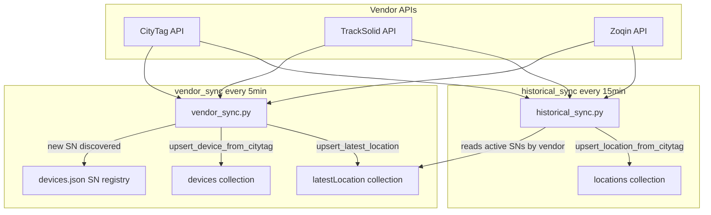
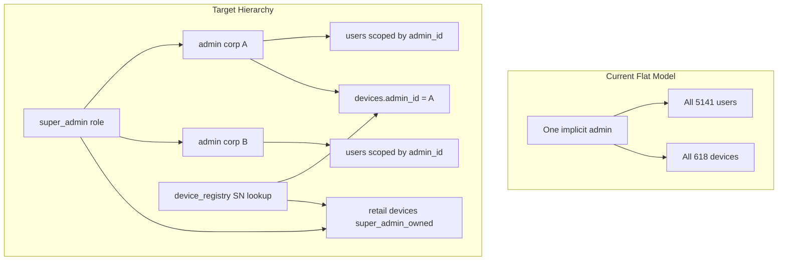
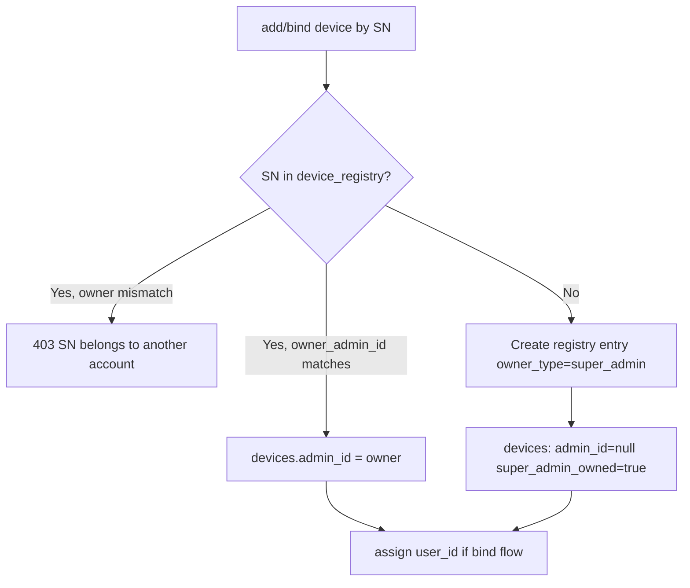
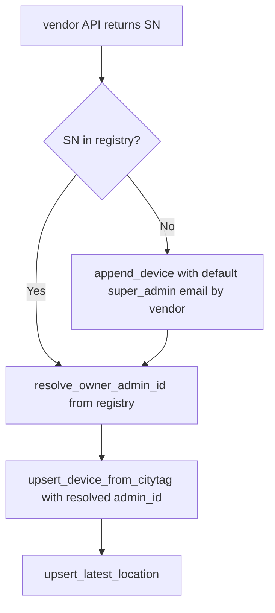
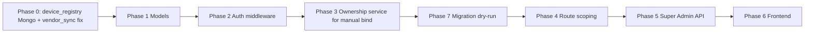

# Three-Tier Hierarchical RBAC — Integration Plan

## Confirmed Design Decisions (from your answers)

| Decision | Choice |
|----------|--------|
| Collection shape | Keep single polymorphic [`accounts`](backend/app/models/admin.py) collection |
| Retail devices | `admin_id: null` + `super_admin_owned: true` on `devices` |
| User permission ceiling | User permissions must be subset of parent Admin's |
| User ↔ Admin | Strict 1:1 via `admin_id` |
| Super Admin on user perms | Super Admin override replaces Admin's settings |
| Device assignment | One `user_id` per device (current schema) |
| Super Admin accounts | `tpl@gmail.com` + `abdulsaboornaeem@gmail.com` (promoted from existing admins) |
| Live device registry | [`devices.json`](backend/app/data/devices.json) (~3300 SNs) — written by vendor sync on auto-discovery |

---

## Core Data Pipeline — Vendor Sync (Must Preserve)

This is the **primary ingestion path** for devices and location data. The RBAC migration must not break it — hierarchy rules plug into this flow, not replace it.

### Two background services ([`auto_sync.py`](backend/app/services/auto_sync.py))

| Service | Interval | Entry point | Writes to | Reads from |
|---------|----------|-------------|-----------|------------|
| **Latest location sync** | 300s | [`run_vendor_sync_all`](backend/app/services/vendor_sync.py) | `devices`, `latestLocation` | CityTag, TrackSolid, Zoqin vendor APIs |
| **Historical sync** | 900s | [`run_historical_sync_all`](backend/app/services/historical_sync.py) | `locations` (326K+ docs) | Vendor history APIs, keyed by SNs in `latestLocation` |

Both start on app boot via [`main.py`](backend/app/main.py) → `start_auto_sync_tasks()`. Manual trigger: `POST /api/sync/all` (vendor sync only).



### How auto-provisioning works today

1. **Vendor sync polls** all three vendors on each cycle.
2. **New SN discovered** (not in registry) → [`device_registry.append_device()`](backend/app/services/device_registry.py) writes to **`devices.json`** with a default admin email + vendor:
   - **CityTag** new devices → `abdulsaboornaeem@gmail.com` (`VENDOR_ADMIN_CITYTAG_EMAIL`)
   - **TrackSolid / Zoqin** new devices → `tpl@gmail.com` (`VENDOR_ADMIN_TPL_EMAIL`)
3. **Device doc created/updated** via [`upsert_device_from_citytag()`](backend/app/services/mongodb.py) with metadata from vendor.
4. **Latest GPS point** written to `latestLocation` (used by dashboard, map, online/offline).
5. **Historical sync** reads recently-active SNs from `latestLocation` (grouped by `vendor` tag), fetches trajectory windows, writes to `locations`.

**Super Admin accounts in this model:**
- `tpl@gmail.com` — ingestion owner for TrackSolid + Zoqin fleet
- `abdulsaboornaeem@gmail.com` — ingestion owner for CityTag fleet (sync credentials: `CITYTAG_SYNC_EMAIL`)

Both will be promoted to `role: "super_admin"` in migration. Corporate admins receive devices when Super Admin **reassigns SN ownership** in the registry (today: edit `admin` field in `devices.json`; target: Mongo `device_registry` + Super Admin UI).

### Critical gap found in current code (must fix in migration)

`devices.json` stores `admin` email per SN, but **`vendor_sync` does not use it** when setting `devices.admin_id`. It always passes the sync service account's Mongo `_id`:

| Vendor | Registry default admin email | `upsert_device_from_citytag(admin_id=...)` actually uses |
|--------|------------------------------|----------------------------------------------------------|
| CityTag | `abdulsaboornaeem@gmail.com` | abdulsaboornaeem's `_id` (coincidentally same today) |
| TrackSolid | `tpl@gmail.com` | tpl's `_id` (coincidentally same today) |
| Zoqin | `tpl@gmail.com` | tpl's `_id` (coincidentally same today) |

**Problem:** If Super Admin reassigns an SN to a corporate admin in `devices.json` (e.g. `"admin": "corp@client.com"`), the next vendor sync cycle **does not update** `devices.admin_id` — it keeps stamping the sync account's `_id` (and only sets `admin_id` if missing: line 603 in `mongodb.py`).

**Fix (Phase 0 — before RBAC UI):** Centralize `resolve_owner_admin_id(sn, registry_entry)` and call it from **both** `vendor_sync` and manual bind flows:

```python
async def resolve_owner_admin_id(mongo, registry_entry) -> tuple[ObjectId|None, bool]:
    """Returns (admin_id, super_admin_owned) from registry owner email."""
    owner_email = registry_entry.get("admin")  # or Mongo owner_admin_id
    if owner_email in SUPER_ADMIN_EMAILS:
        return None, True  # super_admin_owned retail bucket
    admin_doc = await mongo.get_admin_by_email(owner_email)
    return admin_doc._id, False
```

Vendor sync must **re-apply** registry ownership on every cycle (not only on first create), so reassigned SNs flow to the correct corporate admin automatically.

### Revised `device_registry` strategy (devices.json → Mongo)

`devices.json` is a **live write target**, not just a migration artifact. Plan:

1. **Refactor** [`device_registry.py`](backend/app/services/device_registry.py) into a **Mongo-backed service** with the same API (`load_devices`, `append_device`, `index_by_sn`, `save_devices`).
2. **Dual-write during transition:** `append_device` writes Mongo `device_registry` AND mirrors to `devices.json` (so existing ops/debug workflows keep working).
3. **Read path:** Mongo first, fall back to JSON if entry missing.
4. **Migration script** imports all ~3300 JSON entries into Mongo with correct `owner_admin_id` resolved from `admin` email.
5. **Super Admin batch SN registration** (`POST /api/super-admin/device-registry/batch`) updates Mongo registry; next vendor sync cycle picks up the new owner.

Mongo `device_registry` schema adds `vendor` field (from JSON) since vendor sync uses it to route API calls:

```json
{
  "sn": "2P7jVouR2",
  "vendor": "zoqin",
  "owner_type": "super_admin" | "admin",
  "owner_admin_id": ObjectId | null,
  "owner_email": "tpl@gmail.com",
  "provisioned_at": ISODate,
  "provisioned_by": ObjectId,
  "status": "unassigned" | "linked",
  "source": "vendor_auto" | "super_admin_batch" | "migration"
}
```

### Historical sync — no hierarchy changes needed

[`historical_sync.py`](backend/app/services/historical_sync.py) does **not** need `admin_id` on `locations` documents (per your spec §3.4). It:
- Reads SNs from `latestLocation` filtered by `vendor` + 24h activity window
- Calls vendor-specific history APIs
- Upserts into `locations` keyed by `(uid, sn, timestamp)`

RBAC scoping for playback/history routes resolves ownership via `devices` collection join at query time — **do not duplicate admin_id into location pings**.

---

## Current State vs Target (Gap Analysis)

The codebase was built for a **single-company deployment** where all admins share one fleet. Evidence:

```165:169:backend/app/routers/admin_users.py
        # Single-company deployment: all admin logins manage one shared fleet and
        # user pool, so every registered end-user must be bindable from any admin.
        users_cursor = mongo.accounts.find({"role": "user"})
```

```93:99:backend/app/services/device_binding.py
    # Single-company deployment: every admin login shares one fleet and user pool,
    # so any admin may bind any registered user (mirrors admin_list_users, which
    # now returns all users). Cross-admin ownership is intentionally NOT enforced.
    device = await mongo.get_device_by_sn(sn)
    if not device:
        raise HTTPException(..., detail="Device does not exist. Please ask your admin to add it first.")
```

**Other critical gaps today:**

| Area | Current | Risk |
|------|---------|------|
| Roles | `"admin"` / `"user"` only in [`dependencies.py`](backend/app/dependencies.py) | No Super Admin concept |
| Permissions | 3 flat booleans (`dashboard_access`, `geofence_access`, `geofence_create_access`) | Not extensible; admins bypass all checks |
| Device registry | JSON file [`app/data/devices.json`](backend/app/services/device_registry.py) keyed by admin **email** | Not queryable, not multi-tenant safe |
| Device bind | Requires pre-existing `devices` doc; no SN→owner resolution | Wrong admin can bind if device exists |
| `GET /api/admin/users` | Returns **all** users | Cross-corporate data leak |
| `GET /api/location/{sn}` | Admins skip ownership check | Any admin reads any SN |
| `POST /api/sync/all` | No auth | Open endpoint |
| `GET /api/devices/validate/{sn}` | Public | SN enumeration |



---

## Phase 1 — Schema & Models (Backend Foundation)

### 1.1 New `permissions` object (replace booleans)

Add [`backend/app/models/permissions.py`](backend/app/models/permissions.py):

```python
DEFAULT_USER_PERMISSIONS = {
    "view_dashboard": True,
    "view_geofence": False,
    "add_geofence": False,
    "view_reports": True,
    "manage_users": False,
    "manage_devices": False,
    "manage_zones": False,
}
DEFAULT_ADMIN_PERMISSIONS = {k: True for k in DEFAULT_USER_PERMISSIONS}
```

Update [`AccountInDB`](backend/app/models/admin.py):
- `role: Literal["super_admin", "admin", "user"]`
- `permissions: PermissionsModel` (admins + users)
- `super_admin_id: Optional[ObjectId]` (admins only)
- `company: Optional[str]` (admins only)
- `created_by: Optional[ObjectId]` (admins + users)

**Backward-compat bridge** (read path only, removed after migration):
- If `permissions` missing, derive from legacy booleans:
  - `dashboard_access` → `view_dashboard`
  - `geofence_access` → `view_geofence`
  - `geofence_create_access` → `add_geofence` + `manage_zones`

### 1.2 `devices` collection

Update [`DeviceInDB`](backend/app/models/device.py):
- Add `super_admin_owned: bool = False`
- Document rule: retail devices have `admin_id=None, super_admin_owned=True`; corporate devices have `admin_id=<admin._id>, super_admin_owned=False`

### 1.3 MongoDB `device_registry` collection (evolution of `devices.json`)

See **Core Data Pipeline** section above. This is not a greenfield collection — it replaces the live JSON registry that [`vendor_sync.py`](backend/app/services/vendor_sync.py) already writes to on every new SN discovery.

New [`backend/app/models/device_registry.py`](backend/app/models/device_registry.py) + Mongo methods in [`mongodb.py`](backend/app/services/mongodb.py):

```json
{
  "sn": "2P7jVouR2",
  "vendor": "zoqin",
  "owner_type": "super_admin" | "admin",
  "owner_admin_id": ObjectId | null,
  "owner_email": "tpl@gmail.com",
  "provisioned_at": ISODate,
  "provisioned_by": ObjectId,
  "status": "unassigned" | "linked",
  "source": "vendor_auto" | "super_admin_batch" | "migration"
}
```

Indexes: unique on `sn`; compound on `owner_admin_id + status`; index on `vendor`.

**Refactor [`device_registry.py`](backend/app/services/device_registry.py):** same public API, Mongo-backed with dual-write to JSON during transition. [`vendor_sync.py`](backend/app/services/vendor_sync.py) and [`historical_sync.py`](backend/app/services/historical_sync.py) continue calling `load_devices` / `append_device` — no behavioral change at the call site, but reads/writes go to Mongo.

### 1.4 `zones` collection

Add to zone documents (inline schema in [`zones.py`](backend/app/routers/zones.py)):
- `created_by_role: "super_admin" | "admin" | "user"`
- `created_by: ObjectId`

Set on every create/update path in zones router.

---

## Phase 2 — Auth, Roles & Permission Middleware

### 2.1 Extend [`dependencies.py`](backend/app/dependencies.py)

| Dependency | Behavior |
|------------|----------|
| `require_role("super_admin")` | New role value |
| `require_role("admin")` | Allow `admin` OR `super_admin` (super_admin superset) |
| `require_permission("view_geofence")` | Check `account.permissions.*`; skip for `super_admin` |
| `get_account_scope(account)` | Returns `{role, admin_id, user_id, is_super_admin}` helper used by all routers |

Add `SuperAdminInDB` as alias/extension of `AccountInDB` or use unified model with role discriminator (matches your single-collection choice).

### 2.2 Login payload ([`auth.py`](backend/app/routers/auth.py))

Return on login:
```json
{
  "role": "super_admin",
  "permissions": { ... },
  "admin_id": null,
  "company": "Acme Corp"
}
```

Super Admin login: `tpl@gmail.com` and `abdulsaboornaeem@gmail.com` promoted to `role: "super_admin"` in migration (not new accounts).

### 2.3 Permission validation helper

New [`backend/app/services/permission_service.py`](backend/app/services/permission_service.py):
- `assert_permission(account, flag)` — raises 403
- `clamp_user_permissions(admin_perms, requested_user_perms)` — enforces subset rule (§2)
- `effective_user_permissions(user, admin)` — for Super Admin override: if Super Admin last edited user perms, use stored user perms as-is; add `permissions_set_by: ObjectId` audit field to track override source

---

## Phase 3 — Centralized Device Ownership (Shared by Vendor Sync + Manual Bind)

New [`backend/app/services/device_ownership.py`](backend/app/services/device_ownership.py) — **single entry point** used by:
1. **Vendor auto-provision** — every `vendor_sync` cycle when upserting a device
2. **Manual bind** — user/admin adding device by SN in UI
3. **Super Admin batch registration** — assigning SNs to corporate admins

```python
async def resolve_device_ownership(sn, registry_entry, mongo) -> OwnershipResult:
    """
    1. Resolve owner from registry (owner_email / owner_admin_id)
    2. Map super_admin emails → admin_id=null, super_admin_owned=true
    3. Map corporate admin email → admin_id=corp._id
    4. Create or update devices doc with correct admin_id
    5. Mark registry status=linked if user_id assigned
  """
```

**Decision tree for manual bind (user-initiated):**



**Decision tree for vendor auto-provision (every 5 min):**



### Refactor call sites (must all route through `device_ownership`):

| File | Current behavior | Change |
|------|------------------|--------|
| [`vendor_sync.py`](backend/app/services/vendor_sync.py) | Uses sync account `admin_id`, ignores registry `admin` email | **Priority fix:** call `resolve_device_ownership` before every `upsert_device_from_citytag`; re-apply ownership each cycle |
| [`device_binding.py`](backend/app/services/device_binding.py) | Requires existing device doc | Call ownership resolver; remove single-company comments |
| [`devices.py`](backend/app/routers/devices.py) `POST /devices` | Bind only | Resolver + bind |
| [`admin_devices.py`](backend/app/routers/admin_devices.py) `POST /devices` | Admin creates device directly | Register in registry + resolver |
| [`auth.py`](backend/app/routers/auth.py) register/signup if SN bind | If exists | Route through resolver |
| [`device_registry.py`](backend/app/services/device_registry.py) | JSON read/write | Mongo-backed with dual-write; `append_device` also sets `source: vendor_auto` |

**Enforce on bind:**
- Admin can only assign devices where `device.admin_id == self.id` (or `super_admin_owned` if Super Admin acting)
- Admin can only assign to users where `user.admin_id == self.id`
- User can only bind SNs owned by their `admin_id`, or retail SNs they add (visible to Super Admin + self)
- Reject if `device.user_id` already set to another user (existing 409 logic — keep)

---

## Phase 4 — Query Scoping Audit (Every Protected Route)

Add a shared scoping module [`backend/app/services/scope.py`](backend/app/services/scope.py):

```python
def devices_query_for(account) -> dict: ...
def users_query_for(account) -> dict: ...
def zones_query_for(account) -> dict: ...
async def assert_device_access(account, sn, mongo): ...
```

### Route-by-route changes

| Router | Endpoints | Scoping change |
|--------|-----------|----------------|
| [`admin_users.py`](backend/app/routers/admin_users.py) | CRUD users | **Admin:** `admin_id == self._id`; **Super Admin:** all users, grouped by admin |
| [`admin_devices.py`](backend/app/routers/admin_devices.py) | list/create/search | Filter `admin_id == self._id`; Super Admin sees all |
| [`devices.py`](backend/app/routers/devices.py) | list/summary/detail/update/delete | Apply `devices_query_for`; Super Admin unfiltered |
| [`history.py`](backend/app/routers/history.py) | trajectory/playback | Fix `get_authorized_device_sns` admin branch to filter by `admin_id` |
| [`location.py`](backend/app/routers/location.py) | `GET /location/{sn}`, batch | **Fix:** admin must pass `assert_device_access` (currently skips) |
| [`zones.py`](backend/app/routers/zones.py) | CRUD/assign | Replace `_require_admin_or_fence_create` with `require_permission`; Super Admin can act on any admin's zones |
| [`geofence.py`](backend/app/routers/geofence.py) | status/tracks/report | `require_permission("view_geofence")`; scope devices by role |
| [`field_staff.py`](backend/app/routers/field_staff.py) | live-devices | Super Admin: all; Admin: `admin_id` filter |
| [`categories.py`](backend/app/routers/categories.py) | create/delete | Super Admin + Admin with permission |
| [`sync.py`](backend/app/routers/sync.py) | `POST /sync/all` | **Add auth:** Super Admin only |
| [`devices.py`](backend/app/routers/devices.py) | `validate/{sn}` | Require auth OR return minimal non-leaking response |

### Fix [`get_authorized_device_sns`](backend/app/services/mongodb.py)

Current admin branch returns all matching SNs without `admin_id` filter — **must add** `query["admin_id"] = account.id` (and handle `super_admin_owned` for Super Admin queries).

---

## Phase 5 — New Super Admin API

New router [`backend/app/routers/super_admin.py`](backend/app/routers/super_admin.py) mounted at `/api/super-admin`:

| Endpoint | Purpose |
|----------|---------|
| `GET /admins` | List all corporate admins with user counts, company |
| `POST /admins` | Create admin (sets `super_admin_id`, `permissions`, `company`) |
| `PUT /admins/{id}` | Edit admin + permissions |
| `DELETE /admins/{id}` | Soft-delete or hard-delete (confirm with you) |
| `GET /admins/{id}/users` | Users under one admin |
| `POST /device-registry/batch` | Register SN batch to admin or retail |
| `GET /device-registry` | Paginated registry with filters |
| `PUT /users/{id}/permissions` | Super Admin override on user permissions |
| `GET /overview` | Platform stats (accounts by role, devices by admin) |

Register in [`main.py`](backend/app/main.py).

---

## Phase 6 — Frontend Integration

### 6.1 Auth layer

Update [`AuthContext.jsx`](frontend/src/context/AuthContext.jsx) and [`LoginForm.jsx`](frontend/src/components/LoginForm.jsx):
- Store `permissions` object (not 3 booleans)
- `isSuperAdmin = role === "super_admin"`
- `isAdmin = role === "admin" || isSuperAdmin` (for nav compatibility where appropriate)
- Add `hasPermission(flag)` helper

New [`frontend/src/hooks/usePermissions.js`](frontend/src/hooks/usePermissions.js):
```js
export function usePermissions() {
  const { user, role } = useAuth();
  const has = (flag) => role === 'super_admin' || Boolean(user?.permissions?.[flag]);
  return { has, permissions: user?.permissions ?? {} };
}
```

### 6.2 Navigation ([`Sidebar.jsx`](frontend/src/components/layout/Sidebar.jsx), [`App.jsx`](frontend/src/App.jsx))

Replace boolean checks with permission flags:

| Nav item | Gate |
|----------|------|
| Dashboard | `view_dashboard` or super_admin |
| Fence | `view_geofence` or `add_geofence` |
| Reports | `view_reports` |
| Users | `manage_users` (admin) OR super_admin (sees all admins) |
| Super Admin panel | `role === super_admin` only |

Route guards in `App.jsx` mirror sidebar logic.

### 6.3 Hierarchical User Management ([`UsersPage.jsx`](frontend/src/pages/UsersPage.jsx))

Restructure from flat table to collapsible tree:

```
Super Admin view:
  ▼ Acme Corp (admin)
      User A, User B
  ▼ Beta Logistics (admin)
      User C

Admin view:
  ▼ My Company (self, auto-expanded)
      User A, User B
```

Implementation approach:
- Super Admin: `GET /api/super-admin/admins` + lazy `GET /api/super-admin/admins/{id}/users`
- Admin: keep `GET /api/admin/users` (now scoped) — single branch UI
- Extract [`PermissionsChecklist.jsx`](frontend/src/components/PermissionsChecklist.jsx):
  - Super Admin editing Admin/User: all flags enabled
  - Admin editing User: flags capped by `useAuth().permissions` (grey out unavailable)
  - Maps to new `permissions` object in API payload

Update [`useCityTag.js`](frontend/src/hooks/useCityTag.js):
- Add super-admin API methods
- Change `adminUpdateUser` to send `permissions: {...}` instead of individual booleans
- Deprecate `dashboard_access` / `geofence_access` in API calls after migration

### 6.4 Device bind flows

Update bind modals in [`Devices.jsx`](frontend/src/pages/Devices.jsx), [`AddDeviceToUserModal.jsx`](frontend/src/components/AddDeviceToUserModal.jsx), [`AssignUserModal.jsx`](frontend/src/components/AssignUserModal.jsx):
- Surface backend error "SN belongs to another account" clearly
- Admin device dropdown: only devices where `admin_id` matches (backend already filters post-scoping fix)

### 6.5 Reports scoping

[`Reports.jsx`](frontend/src/pages/Reports.jsx): Users with `view_reports` see only their assigned devices in picker (backend enforces; frontend uses scoped device list).

---

## Phase 7 — Migration Script (Review Before Run)

New [`backend/scripts/migrate_hierarchy.py`](backend/scripts/migrate_hierarchy.py) with `--dry-run` flag:

**Steps:**
1. Promote `tpl@gmail.com` and `abdulsaboornaeem@gmail.com` to `role: "super_admin"` (keep existing `_id`, uid, citytag_token, passwords)
2. All other `role: "admin"` docs → add `super_admin_id` (pointing to tpl or abdulsaboornaeem — pick primary), `permissions: all true`, `created_by`
3. All `role: "user"` docs → add `permissions` derived from legacy booleans (preserve current access):
   - `dashboard_access` true (default) → `view_dashboard: true`
   - `geofence_access` → `view_geofence: true`
   - `geofence_create_access` → `add_geofence: true`, `manage_zones: true`
   - `view_reports: true` if `view_dashboard` (matches current Reports access for all users)
4. Import all ~3300 entries from [`devices.json`](backend/app/data/devices.json) into Mongo `device_registry`:
   - Resolve `owner_email` → `owner_admin_id` (super_admin emails → `owner_type: super_admin`, `owner_admin_id: null`)
   - Set `vendor` from JSON, `source: migration`, `status: linked` if matching `devices` doc exists
5. All `devices` → reconcile `admin_id` against registry (fix any mismatches from vendor sync gap); set `super_admin_owned: true` where owner is a super_admin email
6. All `zones` → `created_by_role: "admin"`, `created_by: admin_id` (flag orphans)
7. Print before/after counts: accounts by role, devices by admin_id, registry by owner, zones by admin_id, registry-vs-devices mismatches

**Do not auto-run.** Staging dry-run first against a MongoDB snapshot of `citytag_development`.

---

## Phase 8 — Indexes & Integrity Constraints

Add to [`seed_users.py`](backend/seed_users.py) or migration:

| Collection | Index |
|------------|-------|
| `accounts` | `{role: 1, admin_id: 1}` |
| `accounts` | `{role: 1, super_admin_id: 1}` |
| `device_registry` | unique `{sn: 1}` |
| `devices` | `{admin_id: 1, super_admin_owned: 1}` |
| `locations` | `{sn: 1, timestamp: -1}` (verify exists) |

Application-level constraints:
- User create: always set `admin_id` (Admin creates) or explicit Super Admin path
- User permission update: `clamp_user_permissions` server-side
- Device bind: single `resolve_device_ownership` path only

---

## Implementation Order (Recommended)

**Vendor sync integrity comes first** — without correct registry→admin_id resolution, hierarchy scoping will be wrong regardless of RBAC middleware.



Phase 0 (new): Mongo-backed registry + fix `vendor_sync` to resolve `admin_id` from registry `owner_email` on every cycle. This can ship independently and immediately improves data integrity for corporate admin reassignment.

---

## Files Touched Summary (Deliverable 7 preview)

**Backend — new files:**
- `app/models/permissions.py`, `app/models/device_registry.py`
- `app/services/device_ownership.py`, `app/services/permission_service.py`, `app/services/scope.py`
- `app/routers/super_admin.py`
- `scripts/migrate_hierarchy.py`

**Backend — modified:**
- `app/models/admin.py`, `app/models/user.py`, `app/models/device.py`
- `app/dependencies.py`, `app/services/mongodb.py`, `app/services/device_binding.py`, `app/services/device_registry.py`, `app/services/vendor_sync.py`
- `app/routers/auth.py`, `admin_users.py`, `admin_devices.py`, `devices.py`, `zones.py`, `geofence.py`, `history.py`, `location.py`, `field_staff.py`, `categories.py`, `sync.py`
- `app/main.py`, `seed_users.py`

**Frontend — new:**
- `src/hooks/usePermissions.js`, `src/components/PermissionsChecklist.jsx`

**Frontend — modified:**
- `src/context/AuthContext.jsx`, `src/App.jsx`, `src/components/layout/Sidebar.jsx`
- `src/pages/UsersPage.jsx`, `src/hooks/useCityTag.js`
- `src/pages/Devices.jsx`, `src/pages/Fencepage.jsx`, `src/pages/Reports.jsx`, `src/pages/Dashboard.jsx` (permission gates)

---

## Risk Mitigation

- **Dual-read permissions** during rollout: backend reads `permissions` object, falls back to legacy booleans until migration completes
- **Staging dry-run** mandatory before production migration
- **No silent cross-admin reassignment**: ownership resolver rejects mismatched SNs with explicit 403
- **Backend-first**: all UI permission hiding is convenience; every route gets `require_permission` or scope filter
